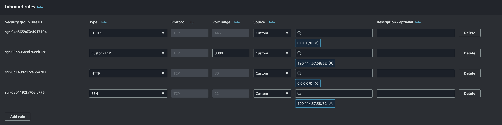
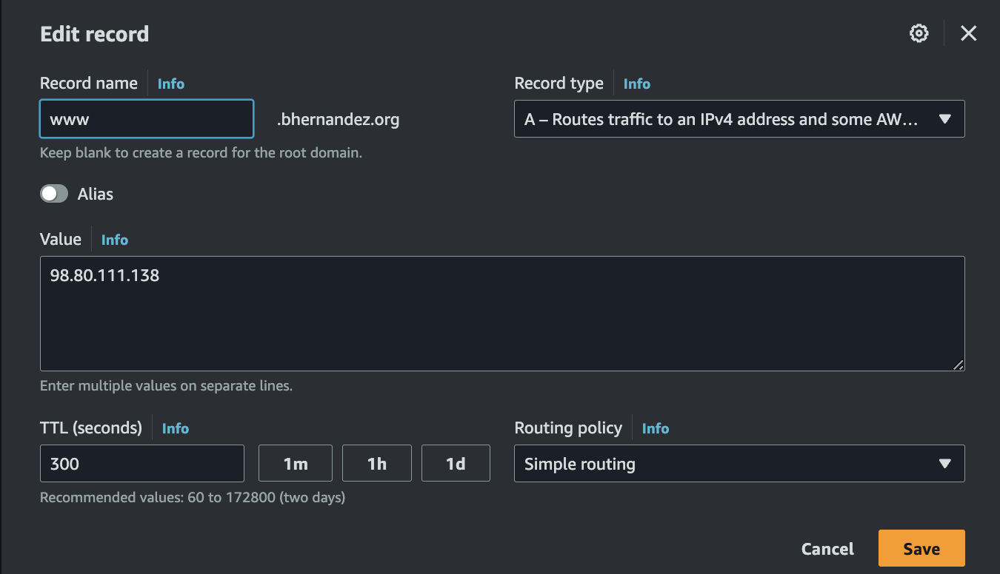
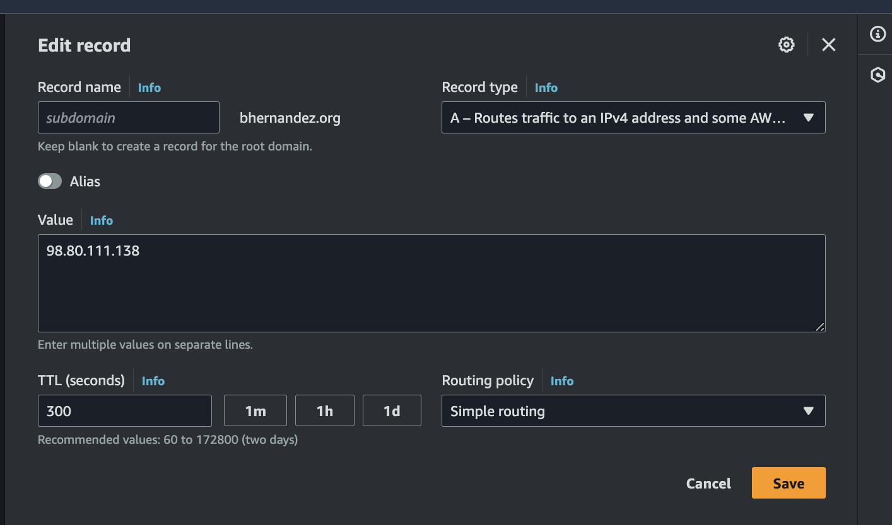

# Despliegue de Servicio con Traefik y Certificado TLS

Con esta documentación, deberías poder deployar tu servicio con un proxy reverso muy potente (Traefik) y, además con certificado TLS auto-renovable utilizando Let's Encrypt.

Este proyecto está implementado en AWS, pero puede ser migrado a cualquier proveedor de nube siguiendo la misma lógica. Si no estás familiarizado, puedes crearte una cuenta de AWS gratis.

El proyecto se deploya con Terraform, lo cual facilita la implementación rápida de todos los recursos y la instalación/configuración de las dependencias. Es totalmente customizable y mejorable para tu proyecto.

## Requisitos

1. Tener un dominio propio. Puedes comprarlo aca : https://www.namecheap.com/
2. Instalar Terraform en tu máquina local. https://developer.hashicorp.com/terraform/tutorials/aws-get-started/install-cli
3. tener un access key para tu usuario tipo Command Line Interface (CLI)
 
## Pasos

### 1. Crear una clave PEM

Iniciamos sesión en nuestra cuenta de AWS y creamos una llave PEM. Descargamos el archivo.

### 2. Configurar un Security Group

Creamos un security group en la VPC que vamos a utilizar en este proyecto y habilitamos los siguientes puertos:
- **80, 443**: Para todo el tráfico entrante (0.0.0.0/0).
- **8080**: Solo para tu IP pública, ya que este puerto lo utiliza Traefik para acceder al dashboard.
- **SSH**: Para acceder a la instancia solo desde tu IP pública.



### 3. Crear una Elastic IP

Creamos una Elastic IP, una IP pública fija que va a usar nuestra instancia EC2.

### 4. Configurar Route 53

En Route 53, creamos 2 registro con nuestros dominio o subdominios apuntando a la Elastic IP que acabamos de crear.




### 5. Configurar Terraform

Modificamos el archivo `terraform/ec2.tf` con los siguientes parámetros:

```
locals {
    instance_type    = "t2.micro" # Tipo de instancia
    ami              = "ami-0e001c9271cf7f3b9" # Imagen Ubuntu 20.04
    key_pem_name     = "traefik_example" # Nombre de la clave PEM creada
    security_groups  = ["sg-xxxxxx"] # Security group creado en la VPC que vamos a utilizar
    subnet_id        = "subnet-xxxxxxx" # ID de la subred donde se va a crear la instancia (misma VPC donde se creo el security group)
    allocation_id    = "eipalloc-07XXXXXXXXX" # ID de la Elastic IP creada
    pem_route        = "~/git/pems/traefik_example.pem" # Ruta de la llave privada (key PEM)
}
```

### 5. Configurar Terraform

Agregamos nuestras credenciales de AWS Cli al archivo o las configuramos como variables de entorno para mayor seguridad:

```
provider "aws" {
    region     = "us-east-1"
    access_key = "LFUXXXXXXXXXXXXXXXXXXXXXX"
    secret_key = "+ETdXXXXXXXXXXXXXXXXXXXXXXXXXXXXXXXX"
}
```

### 7. Configurar Let's Encrypt

Editamos el archivo certificado/docker-compose.yml y cambiamos el correo por uno personal, ya que Let's Encrypt enviará notificaciones a esa dirección:

```
- "--certificatesresolvers.myresolver.acme.email=my_correo@gmail.com"
```


### 8. Configurar el Servicio con NGINX

En el archivo app/app.yml, configuramos nuestro servicio. En este caso, utilizamos una imagen de NGINX con una serie de reglas para que Traefik las pueda leer:

```
version: "3.3"
services:

  nginx_test:
    image: nginx
    labels:
      # Router para manejar tanto www.mydomain.org como mydomain.org
      - "traefik.enable=true"
      - "traefik.http.routers.nginx.rule=Host(`mydomain.org`) || Host(`www.mydomain.org`)"
      - "traefik.http.routers.nginx.entrypoints=websecure"
      - "traefik.http.routers.nginx.tls=true"
      - "traefik.http.routers.nginx.tls.certresolver=myresolver"

      # Middleware para redirigir de mydomain.org a www.mydomain.org
      - "traefik.http.middlewares.redirect-to-www.redirectregex.regex=^https?://mydomain.org/(.*)"
      - "traefik.http.middlewares.redirect-to-www.redirectregex.replacement=https://www.mydomain.org/$1"
      - "traefik.http.routers.nginx.middlewares=redirect-to-www"
    networks:
      - traefik-net
      
networks:
  traefik-net:
    external: true
```

Recuerda cambiar www.mydomain.org y mydomain.org por tu dominio. La primera regla indica que, si llega una solicitud desde www.mydomain.org o mydomain.org, este servicio será el que responda. La segunda regla asegura que cualquier solicitud a mydomain.org se redirigirá automáticamente a www.mydomain.org.

### 9. Deployar la Infraestructura con Terraform

Desde la terminal, ingresamos a la carpeta de Terraform y ejecutamos el siguiente comando:

```
terraform init
```
```
terraform apply
```

Esto comenzará a crear toda la infraestructura, instalar y configurar Docker en nuestra instancia, ademas enviar los archivos de Docker que vamos a deployar.

### 10. Desplegar los Servicios

Accedemos a nuestro servidor vía SSH y deployamos los servicios:

```
sudo docker compose up -d
```
```
docker compose -f app.yml up -d
```

### 11. Acceso al Servicio

Ahora ya puedes acceder a tu servicio desde tu dominio.

si guieres ingresar al dasboard de traefik debe usar esta ruta : 

http://INSTANCE_PUBLIc_IP:8080/dashboard/

